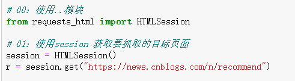
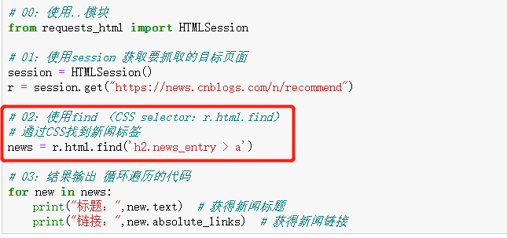
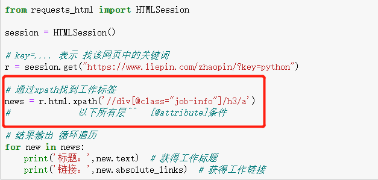
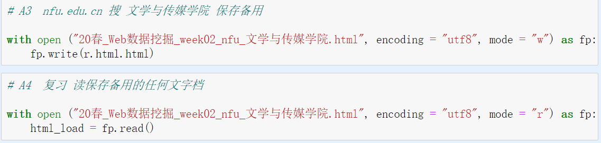
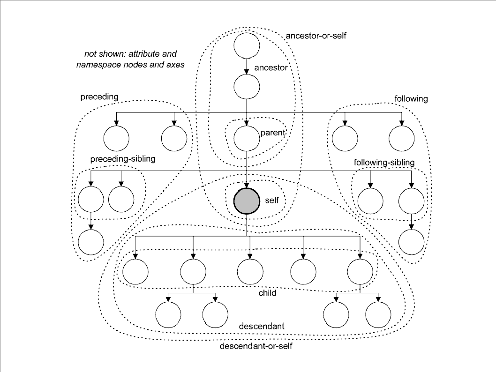
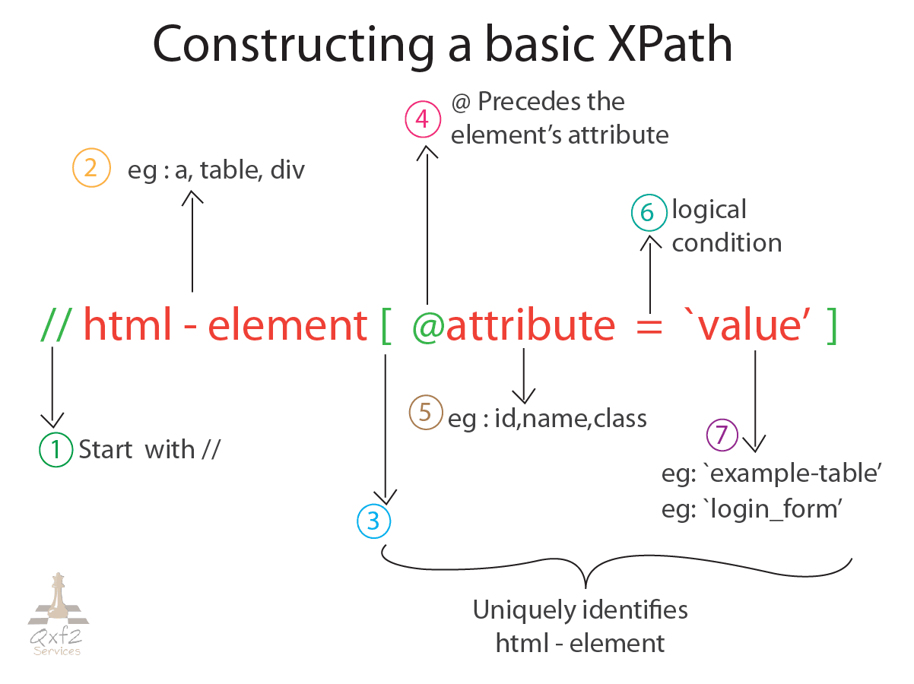
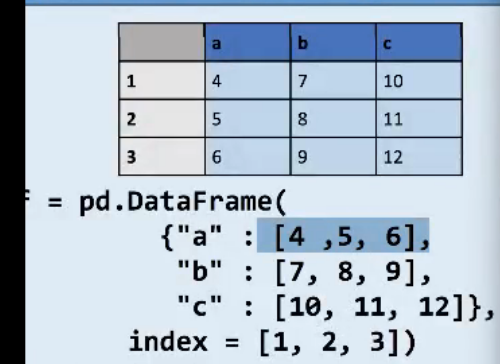
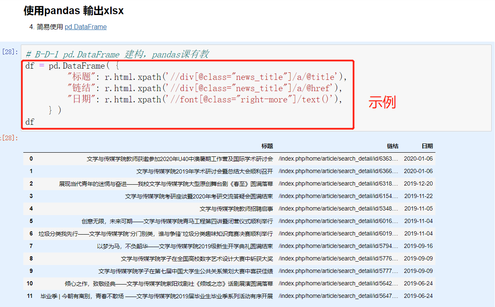
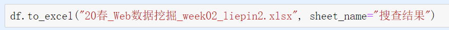

# Web_mining
20春_数据挖掘课

## 本周小结内容：181013114 梁善宜

### 摘要：本周学习HTML解析（parse HTML）及Xpath实践。实践练习的作业可打开20春_Web数据挖掘_week02_181013114文件查看

##### 如何抓取某个页面中的信息？

- 基本结构：使用request_html模块

- 关于request_html模块更多使用方法：
- r.html.links → 可以看到所有的URL，并返回一个列表
- r.html.absolute_links → 可以获得绝对路径的URL
- r.html.html → 可存网页为文字档
- 参考资料：[requests-html 中文文档](https://cncert.github.io/requests-html-doc-cn/#/)

- 两个方法抓取：①CSS selector（选择器）②Xpath抓取
- ①CSS selector（选择器）:r.html.find

- ②Xpath抓取:r.html.xpath('')

##### 保留备份文件方法？

- 参考代码如下：

##### 什么是Xpath？
- Xpath是一门xml文档中查找信息的**语言**，可以用来找到网页上某个特定的内容（数据）。
- 需了解[xpath语法](https://www.w3cschool.cn/xpath/xpath-syntax.html)和[xpath的节点](https://www.w3cschool.cn/xpath/xpath-nodes.html)
- 关于xpath的节点，参考图片（由廖汉腾老师提供）：

##### Xpath基本定位方法：

- 参考图片(由廖汉腾老师提供)：

- 参考的资料：[xpath之定位方法](https://www.jianshu.com/p/90841cc66893)

##### 使用pandas 輸出xlsx？
- 成功爬取网页数据后，可以**引用pandas模块**生成表格：

##### 如何导出excel？
- 代码如下：

